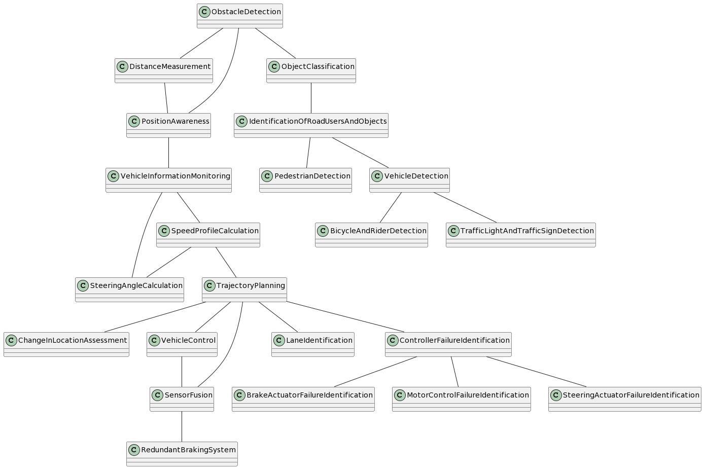
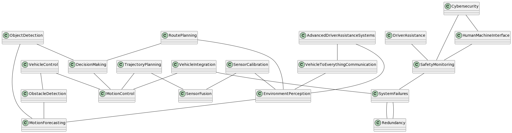

# Method

## Initial try

We gave each chat model the following prompts:

1. I will give you some requirements. Please read them and answer with "ok"
2. <... the requirements from https://github.com/panorama-research/mobstr-dataset/tree/master, omitted for license reasons ...>
3. For these requirements, please extract the domain concepts of the system
4. Please list the relations of these domain concepts to each other
5. please combine the concepts and their relations into a plantuml diagram

You can see the exact responses in the respective files.

We then generated the PlantUML povided by the AI, and also created one manually from the information given.

## Minor prompt engineering

After playing around with the prompts a bit, we applied some prompt engineering to see the impact on the results.
We changed the prompts to the following:

1. I will give you some requirements. Please read them and answer with "ok".
2. <... the requirements from https://github.com/panorama-research/mobstr-dataset/tree/master, omitted for license reasons ...>
3. You are a domain expert. Please extract all domain concepts related to this system. Do not attempt to model the system itself.
4. Please list all relations of these domain concepts to each other. List one relation per line, output the concepts in PascalCase, like "DomainConceptA", and separate the related concepts in each line with "--". Do not explain the relations.
5. Make the list exhaustive.

The direct generation of plantuml code does not seem to work well, so we skipped it in the second try.
Instead, we generated the plantuml from the last output only, using only a few regex commands.
We assume that this can be easily automated with a reasonable relability.

# Results

## GPT 3.5

Generated:

Handcrafted from the output

With prompt engineering

## LLaMA 2

Generated:

Handcrafted from the output

With prompt engineering

