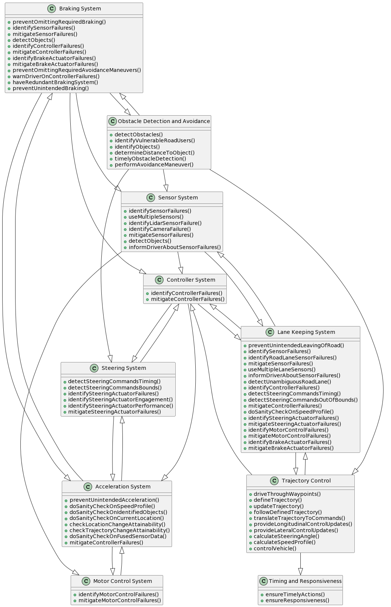
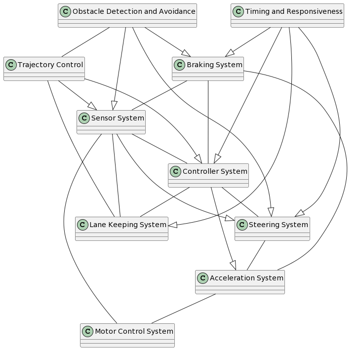
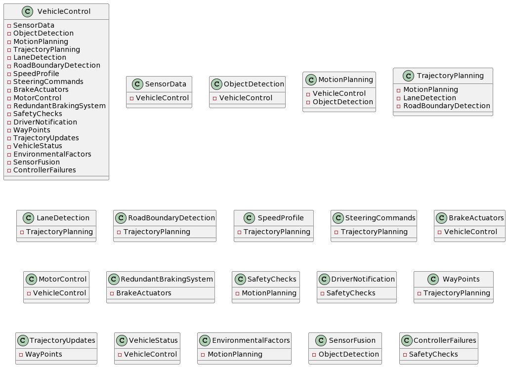
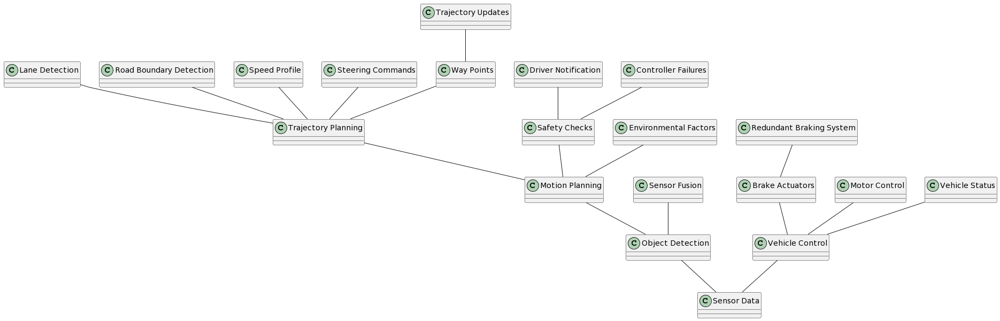

# Method
We gave each chat model the following prompts:

1. I will give you some requirements. Please read them and answer with "ok"
2. <... the requirements from https://github.com/panorama-research/mobstr-dataset/tree/master, omitted for license reasons ...>
3. For these requirements, please extract the domain concepts of the system
4. Please list the relations of these domain concepts to each other
5. please combine the concepts and their relations into a plantuml diagram

You can see the exact responses in the respective files.

We then generated the PlantUML povided by the AI, and also created one manually from the information given.

# Results

## GPT 3.5

Generated:

Handcrafted from the output

## LLaMA 2

Generated:

Handcrafted from the output

