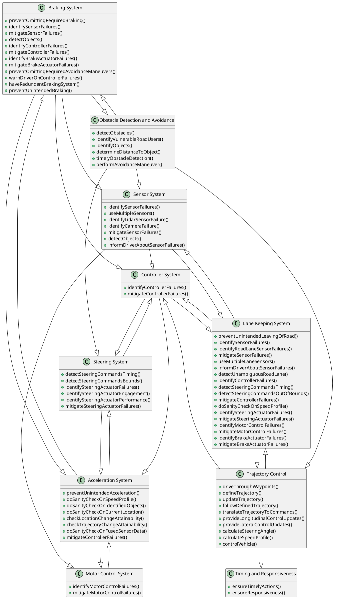

# user
I will give you some requirements. Please read them and answer with "ok"

# AI
Sure, go ahead and provide the requirements. I'll do my best to respond with "ok."

# user
<... omitted for license reasons ...>

# AI
Ok

# user
For these requirements, please extract the domain concepts of the system

# AI
The domain concepts extracted from the provided requirements include:

1. **Braking System:**
   - Required braking maneuvers
   - Brake actuator failures
   - Mitigation of brake actuator failures
   - Unintended braking prevention

2. **Sensor System:**
   - Identification of sensor failures
   - Use of multiple sensors
   - Lidar sensor failure identification
   - Camera failure identification
   - Mitigation of sensor failures
   - Object detection using sensor fusion
   - Informing the driver about sensor failures

3. **Controller System:**
   - Identification of controller failures
   - Mitigation of controller failures

4. **Steering System:**
   - Steering command timing detection
   - Steering command bounds checking
   - Steering actuator failures identification
   - Steering actuator engagement detection
   - Steering actuator performance monitoring
   - Mitigation of steering actuator failures

5. **Acceleration System:**
   - Unintended acceleration prevention
   - Sanity checks on speed profile, identified objects, current location, and fused sensor data

6. **Motor Control System:**
   - Motor control failures identification
   - Mitigation of motor control failures

7. **Lane Keeping System:**
   - Road lane sensor failures identification
   - Road lane identification ambiguity detection
   - Unintentional road departure prevention
   - Trajectory definition and updating
   - Following the defined trajectory
   - Vehicle command translation from trajectory
   - Longitudinal and lateral control value updates

8. **Obstacle Detection and Avoidance:**
   - Obstacle detection
   - Vulnerable road user identification
   - Object categorization (pedestrians, cars, trucks, buses, motorbikes, bicycles, riders, traffic lights, traffic signs)
   - Distance determination to objects
   - Timely obstacle detection
   - Avoidance maneuvers (braking and lane changes)

9. **Trajectory Control:**
   - Waypoint navigation
   - Trajectory calculation
   - Speed profile calculation
   - Vehicle control using calculated commands
   - Awareness of vehicle status, position, and key information

10. **Timing and Responsiveness:**
    - Timing for braking, steering, and lane change actions
    - Responsiveness in providing control updates

These concepts collectively define the functionality and behavior of the autonomous driving system based on the specified requirements.

# user
Please list the relations of these domain concepts to each other

# AI
Certainly, here are the relations between the extracted domain concepts:

1. **Braking System:**
   - Related to Sensor System for detecting obstacles.
   - Connected to Controller System for handling brake actuator failures.
   - Interacts with Acceleration System to prevent unintended braking.

2. **Sensor System:**
   - Connected to Braking System for obstacle detection.
   - Interacts with Controller System for identifying sensor failures.
   - Linked to Steering System and Lane Keeping System for lane and obstacle detection.
   - Influences Motor Control System for awareness and mitigation of sensor failures.

3. **Controller System:**
   - Related to Braking, Steering, and Acceleration Systems for identifying and mitigating failures.
   - Connected to Sensor System for managing sensor failures.
   - Linked to Lane Keeping System for trajectory control and updates.

4. **Steering System:**
   - Connected to Controller System for failures and mitigation.
   - Interacts with Acceleration System for preventing unintended steering actions.

5. **Acceleration System:**
   - Interacts with Braking and Steering Systems to prevent unintended actions.
   - Linked to Motor Control System for awareness and mitigation of failures.

6. **Motor Control System:**
   - Connected to Acceleration System for failures and mitigation.
   - Influenced by Sensor System for awareness of motor control failures.

7. **Lane Keeping System:**
   - Connected to Controller System for trajectory control and updates.
   - Linked to Sensor System for road lane detection.
   - Interacts with Trajectory Control System for defining and following trajectories.

8. **Obstacle Detection and Avoidance:**
   - Interacts with Braking, Steering, and Sensor Systems for obstacle detection and avoidance.
   - Connected to Trajectory Control System for adjusting the trajectory based on obstacles.

9. **Trajectory Control:**
   - Interacts with Lane Keeping and Obstacle Detection Systems for defining and updating trajectories.
   - Connected to Controller System for control updates.
   - Influences Sensor System for trajectory-based object detection.

10. **Timing and Responsiveness:**
    - Linked to Braking, Steering, and Lane Change Systems for ensuring timely actions.
    - Connected to Controller System for responsiveness in case of failures.

These relations illustrate the interdependencies and interactions among the different domain concepts within the autonomous driving system.

# user
please combine the concepts and their relations into a plantuml diagram

# AI
I'm unable to generate diagrams or visual content directly. However, I can provide you with a textual representation of the PlantUML code, and you can use it in a PlantUML editor or tool to generate the diagram. Here's a simplified textual representation of the PlantUML code for the relations:

Copy and paste this code into a PlantUML editor or tool to visualize the diagram. Keep in mind that this is a simplified representation, and you might want to adjust the layout and styling as needed.
